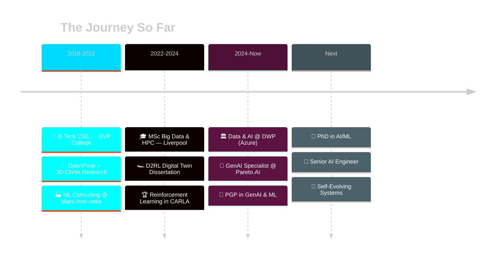

# Naga Sri Ram Kochetti

**AI Systems Architect · Full Stack AI Engineer · Researcher**

 

*I build intelligent systems that reason, scale, and perform under pressure.*
*Turning research papers into production systems — that's my thing.*

 

---

### `> whoami`

I'm an AI engineer based in **London**, currently splitting my time between two worlds:

🏛️ **Data & AI Support Associate @ DWP** — engineering Azure-based AI data platforms for the UK government

💎 **Freelance GenAI Specialist @ Pareto.AI** — building LLM-powered RAG APIs and secure vector search solutions

My background spans an **MSc in Big Data & HPC** from the University of Liverpool and a **B.Tech in CSE** from GVP College. I'm currently pursuing a **PGP in Generative AI & ML** and actively looking for **PhD opportunities** or a **Senior AI Engineer** role — particularly in regulated environments like government, healthcare, and enterprise AI.

---

### `> cat /dev/skills`

<table>
<tr>
<td align="center" width="96">

 <b>Python</b>
</td>
<td align="center" width="96">

 <b>TensorFlow</b>
</td>
<td align="center" width="96">

 <b>PyTorch</b>
</td>
<td align="center" width="96">

 <b>Azure</b>
</td>
<td align="center" width="96">

 <b>AWS</b>
</td>
<td align="center" width="96">

 <b>Docker</b>
</td>
<td align="center" width="96">

 <b>Kubernetes</b>
</td>
<td align="center" width="96">

 <b>TypeScript</b>
</td>
</tr>
<tr>
<td align="center" width="96">

 <b>JavaScript</b>
</td>
<td align="center" width="96">

 <b>FastAPI</b>
</td>
<td align="center" width="96">

 <b>Node.js</b>
</td>
<td align="center" width="96">

 <b>MongoDB</b>
</td>
<td align="center" width="96">

 <b>PostgreSQL</b>
</td>
<td align="center" width="96">

 <b>Redis</b>
</td>
<td align="center" width="96">

 <b>Terraform</b>
</td>
<td align="center" width="96">

 <b>Linux</b>
</td>
</tr>
</table>

 

**AI / ML** &nbsp; `LangChain` `LangGraph` `RAG` `ArcFace` `OpenCV` `HuggingFace` `FAISS` `scikit-learn` `Keras`
 
**Data** &nbsp; `Spark` `Kafka` `Airflow` `dbt` `Pandas` `NumPy` `Power BI` `Elasticsearch`
 
**Cloud** &nbsp; `Azure Synapse` `Data Factory` `Azure ML` `AWS S3` `Lambda` `GCP BigQuery`
 
**DevOps** &nbsp; `GitHub Actions` `CI/CD` `Helm` `Power Platform`

---

### `> ls projects/active/`

<table>
<tr>
<td width="50%">

#### 🌌 DevVerse — *The AI Metaverse*

A developer-focused interactive 3D metaverse that transforms **GitHub profiles into personalized virtual worlds**. Features WebXR/VR support, WebRTC voice chat, AI-generated assets, and a marketplace.

Built with a **10-role AI skill orchestration framework** spanning 36 sprints.

`WebXR` `WebRTC` `Three.js` `AI Asset Generation`

</td>
<td width="50%">

#### 🧬 Face Super-Resolution Identity

Research pipeline evaluating **facial identity preservation** through super-resolution reconstruction. Testing 3 SR models across 3 degradation levels with **ArcFace cosine similarity** scoring on a 3,000-sample dataset.

Recently resolved a critical BGR/RGB format mismatch bug.

`ArcFace` `Super-Resolution` `Computer Vision`

</td>
</tr>
<tr>
<td width="50%">

#### 👑 QueenAI Enterprise

Multi-agent AI customer system using **LangGraph** and **bio-inspired optimization**. Swarm-based agent orchestration for enterprise-grade customer intelligence.

`LangGraph` `Multi-Agent Systems` `Bio-Optimization`

</td>
<td width="50%">

#### 💰 Currency Intelligence Platform V2

AI-driven financial insights with **real-time U.S. Treasury API** integration. Intelligent currency analytics and prediction engine.

`Financial AI` `Treasury API` `Real-time Analytics`

</td>
</tr>
</table>

<b>More completed projects</b>

 

| Project | What it does |
|:---|:---|
| 🏎️ **Digital Twin for Autonomous Driving** | D2RL edge-case simulation using RL in CARLA — *MSc Dissertation* |
| 🌊 **Wastewater Analytics Hybrid-AI** | Supervised learning + anomaly detection for water treatment |
| 🏛️ **Azure AI Data Platform (DWP)** | Enterprise AI infrastructure for UK government |
| 🔐 **LLM RAG APIs (Pareto.AI)** | Production-scale secure vector search solutions |
| 🦴 **Human Action Prediction via OpenPose** | Real-time skeletal keypoint extraction with 3D-CNNs + LSTMs — *B.Tech Thesis* |

---

### `> git log --oneline /life/`

---

### `> neofetch`

  

  

---

### Let's build something together

I'm always open to conversations about **AI systems that push boundaries** — whether that's a PhD collaboration, an open-source project, or just geeking out about self-evolving systems.

 

  

Currently looking for: **PhD opportunities in AI/ML** · **Senior AI Engineer roles** · **Open-source collaborators**
 
Domains: Gov AI · Healthcare · Enterprise Systems · Self-Evolving Intelligent Systems

